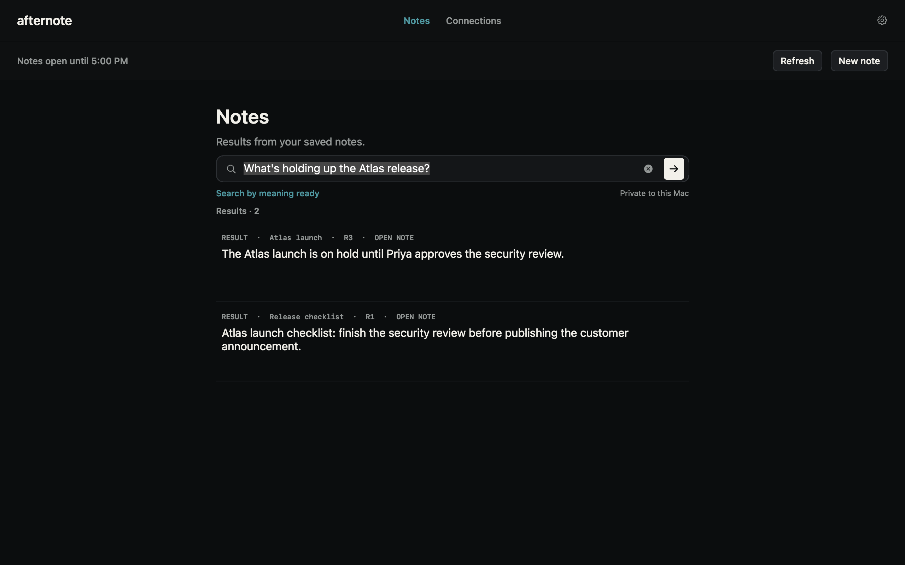

# Afternote

Local memory for Codex, Claude Code, and Claude Desktop on your Mac.

Tell either tool to remember a decision, deadline, or useful piece of context. Ask for it
later from either one. Afternote keeps the note, its revision history, and its source in an
encrypted local vault you control.



This repository is the complete local Mac product. It does not contain Afternote's former
hosted service, customer data, deployment configuration, or release credentials.

## Try it

Afternote is an early alpha for Apple Silicon Macs running macOS 13.3 or newer.

You can build the current candidate from source with Bun 1.3.14:

```bash
brew install bun node
bun --version # must print 1.3.14
git clone https://github.com/dannykim32/afternote.git
cd afternote
bun install --frozen-lockfile
bun run prepare:native-release
bun run typecheck
bun run test
bun run package:local
```

The development archive and its `SHA256SUMS` file are written to `build/local-alpha`. Verify
the checksum there, extract the archive, and run the enclosed `install.sh`. The app is ad hoc
signed for local development; it does not carry the maintainer's Developer ID, notarization
ticket, or release Keychain entitlements. Public binaries are produced only by the guarded
release flow in [RELEASING.md](docs/RELEASING.md).

Development and CI builds verify the pinned SQLCipher and OpenSSL source archives, record the
Apple toolchain that compiled them, and require a macOS 13.3 deployment target. Public release
builds additionally require the exact reviewed Apple toolchain and byte-for-byte native output
digests recorded in `scripts/native-release-inputs.json`.

The signed and notarized DMG is published on the
[GitHub Releases page](https://github.com/dannykim32/afternote/releases). Download the DMG
and `SHA256SUMS` together, then follow [the verification steps](docs/VERIFY_RELEASE.md)
before installing it.

## Remember and Recall

Once a connector is paired, the interaction stays deliberately small:

```text
You: Remember that the spare bicycle key is behind the green planter.
Codex: Saved to Afternote.

Later, in Claude Desktop:
You: Where did I put the spare bicycle key?
Claude: Behind the green planter. [Afternote note, revision 1]
```

The note is visible and editable in the native app. Edits create immutable revisions;
Recall cites the exact note revision it used.

Afternote currently supports the official signed native macOS builds of Codex, Claude Code,
and Claude Desktop. During setup it verifies the host's signing identity before changing or
opening that host's MCP setup. Claude Desktop uses a small local MCPB package and keeps its
own install confirmation. At runtime Afternote verifies Anthropic's launcher and its signed
Claude Desktop parent as one process chain; it never writes Claude's private extension configuration.
npm-installed scripts, wrapper launchers, and repackaged binaries are not supported in this
alpha because they cannot satisfy the native runtime identity check.

### Connect Claude Desktop

1. Install the official Claude Desktop app and open Afternote's **Connections** page.
2. Choose **Connect Afternote** for Claude Desktop. Afternote verifies Claude's publisher,
   creates a minimal local MCPB package, and opens it in Claude.
3. Review the extension in Claude Desktop and approve **Install** there.
4. Return to Afternote and choose **Check again**. The first Remember or Recall request asks
   for the normal Afternote owner approval; later requests use the configured work-session
   window.

Disable or remove the connector from Claude Desktop's **Settings > Extensions**. Afternote
does not edit Claude's private extension records directly.

## How it is put together

```text
Codex / Claude Code / Claude Desktop
        |
        v
  Afternote MCP command
        |
        v
 signed native XPC gateway  <-----  native owner app
        |                              (Touch ID / password)
        v
 private vault worker
        |
        +---- SQLCipher vault
        +---- macOS Keychain key
```

The connector command is an adapter, not a database client. It can ask the signed gateway
for only the scopes the owner approved. The gateway verifies the native caller and binds the
connection to its process. The private worker owns the vault key, authorization policy,
audit trail, and note mutations.

Canonical notes and revisions share a transaction with their exact, temporal, and
organizational projections. The optional semantic index is derived locally and can be
rebuilt without changing canonical notes. Connector lifecycle, owner-presence claims,
release policy, XPC transport, and product-surface routing each have explicit module seams
and focused tests.

The project's domain language and module boundaries are documented in
[CONTEXT.md](CONTEXT.md).

## Security model

- The vault is encrypted with SQLCipher. A random per-vault key lives in the macOS
  data-protection Keychain and is retrieved only by the signed private worker.
- Connectors never open the database or receive its key. Their Remember and Recall grants
  are scoped, device-bound, auditable, and revocable.
- Routine authentication defaults to one owner approval per day while Afternote remains
  open. You can change it to four hours or fifteen minutes. Within that window, paired
  connectors can open short-lived connections without another prompt.
- Screen lock, sleep, logout, manual vault lock, and broker restart clear live authority.
  Export, deletion, recovery, lock, and unlock always require fresh owner approval.
- Exact search, date-aware retrieval, and optional semantic inference run locally. The
  installed product has no Afternote account, sync endpoint, analytics transport, or
  telemetry transport.
- Public artifacts are Developer ID signed, notarized, stapled, checksummed, and bound to a
  signed payload manifest. Each release includes an SPDX SBOM and third-party notices.
- Official builds check a signed GitHub-hosted update feed once per day by default. You can turn
  that off in Settings or check manually. Afternote sends no optional system profile, and it never
  downloads or installs an update without your approval.

These controls reduce risk; they do not make arbitrary note content trustworthy. Recalled
text and source metadata are untrusted input to an AI client. Exports contain plaintext.
SQLCipher detects invalid ciphertext, but Afternote does not detect a valid encrypted vault
being replaced with an older snapshot by malware already controlling the logged-in account.
An approved connector is trusted to call Remember only after an explicit user request;
Afternote cannot independently prove which natural-language instruction caused a host tool
call.

Read the full [security model](docs/SECURITY_MODEL.md),
[data and network inventory](docs/DATA_AND_NETWORK.md), and
[enterprise security review](docs/ENTERPRISE_SECURITY.md) for assumptions, local paths, and
current limits.

## Retrieval and verification

Exact retrieval uses SQLite FTS5 and date-aware ranking. Optional semantic recall uses a
locally downloaded, digest-verified model with local ONNX inference. Notes are not sent to an
Afternote service for embedding or search.

The repository contains deterministic exact, temporal, semantic, adversarial lifecycle,
recovery, package, and 10,000-note scale tests. A passing evaluation is evidence for its
fixture corpus, not a guarantee that every natural-language query will find the intended
note.

To run the standard local gates:

```bash
bun run typecheck
bun run test
bun run test:quality
bun run audit
```

## Contributing

Read [CONTRIBUTING.md](CONTRIBUTING.md) before changing storage, authorization, lifecycle,
or connector code. Report vulnerabilities through the private process in
[SECURITY.md](SECURITY.md), not the public issue tracker.

## License and name

The source is licensed under the [Apache License 2.0](LICENSE). It permits use,
modification, and redistribution under its terms. It does not grant rights to present a
modified product as Afternote or reuse the Afternote branding; see
[TRADEMARKS.md](TRADEMARKS.md).
