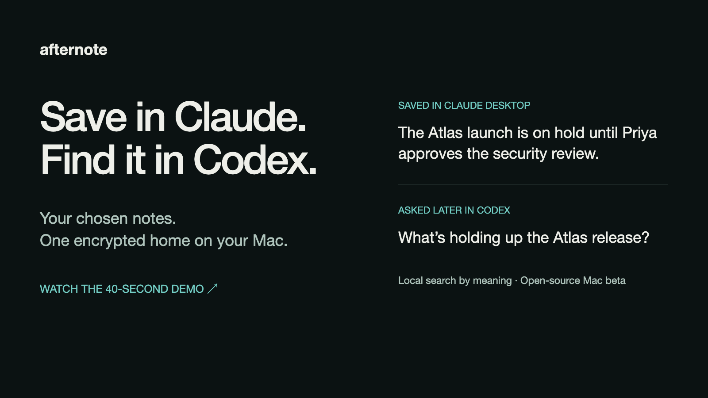

# Afternote

### One home for the notes you choose to keep.

Save a note in Claude. Find it later in Codex, even when you ask differently.
Afternote gives the notes you explicitly save an encrypted home on your Mac,
with local search by meaning and control over each connected tool.

**[Download for Mac](https://github.com/dannykim32/afternote/releases/tag/v2.0.0-beta.5)** ·
[Watch the 40-second demo](https://afternote.dev/#demo) ·
[Getting started](docs/GETTING_STARTED.md) ·
[Security model](docs/SECURITY_MODEL.md)

Free, open-source beta. Apple Silicon · macOS 13.3+ · No Afternote account.

Independently maintained, best-effort software. Read the [beta notice](BETA_NOTICE.md),
[license](LICENSE), and [Local privacy notice](https://afternote.dev/privacy#local).

[](https://afternote.dev/#demo)

## Save here. Find it there.

| In Claude Desktop | Later, in a new Codex conversation |
| --- | --- |
| “Use Afternote to remember: The Atlas launch is on hold until Priya approves the security review.” | “Using Afternote, what’s holding up the Atlas release?” |

Afternote returns the saved note with its source and revision. You can open the
same note in the Mac app to read it, edit it, or inspect its history.

This synthetic example illustrates saving through one connected tool and recalling through another.
The query is checked against the bundled local search models in an isolated vault.
Search can still miss; the citation lets you check what was actually saved.

## Why I built it

I wanted to choose what was worth keeping, then get back to it through whichever
app I was using. Saving something in one conversation shouldn't mean copying it
into the next. I also wanted to decide which tools could access my notes and
revoke that access myself. Afternote is a personal project I built outside my day job.

## Your notes, through the app or your tools

- **Save deliberately.** Write in Afternote or ask an approved tool to remember something.
- **Ask in your own words.** Search by meaning runs locally in the app and through connected tools. Models are included and search by meaning is on by default.
- **Check the original.** Results cite the exact saved note revision and its source.
- **Control access.** Approve each connection, inspect its activity, and revoke access from the app.


**Supported tools:** official signed native macOS builds of Codex, Claude Code,
and Claude Desktop. No browser, Slack, or ChatGPT consumer-app connector in this beta.

Your vault and search stay on your Mac. Text you recall through an AI tool goes
to that tool and may reach its model provider. Afternote collects no app usage telemetry.

## Get started

1. [Download the signed and notarized Mac beta](https://github.com/dannykim32/afternote/releases/tag/v2.0.0-beta.5), then drag **Afternote** into **Applications**.
2. Open the app and use **Connections** to connect a supported tool.
3. Ask it to save a note explicitly to Afternote. Recall it from a new chat or another connected tool.

No Bun, Node, or separate model download is needed for the installed app.
See [installation and connector setup](docs/GETTING_STARTED.md) for the full steps,
[release verification](docs/VERIFY_RELEASE.md) for checksums, and
[beta readiness and limits](docs/BETA_READINESS.md) for what has been tested.

## Large conversations: explicit Archives

Available in the Beta 6 candidate; not included in the current Beta 5 download.

For a transcript too large for a Note, open **Notes > Conversation Archives…** and
import its UTF-8 text or Markdown file (up to 64 MiB). Afternote preserves the text
in the encrypted Vault, with resumable imports and a paged, read-only viewer.
Archive search matches exact words; semantic search still applies to Notes only.

Each Connector needs separate **Allow Archive access** approval in Connections.
Then `search_archives` finds excerpts and `read_archive` retrieves bounded pages.
Afternote does not capture chats automatically or reconstruct missing history.
The original file remains outside the Vault, and passages returned to an AI host
may reach its provider. JSON Vault backups include Archives; Markdown exports do not.

See the [Archive walkthrough and limits](docs/CONVERSATION_ARCHIVES.md#use).

## Architecture

```text
Codex / Claude Code / Claude Desktop
        |
        v
  Afternote MCP command
        |
        v
 signed native XPC gateway  <-----  native owner app
        |                              (Touch ID / password)
        v
 private vault worker
        |
        +---- SQLCipher vault
        +---- macOS Keychain key
```

The connector command is an adapter, not a database client. It can ask the signed gateway
for only the scopes the owner approved. The gateway verifies the native caller and binds the
connection to its process. The private worker owns the vault key, authorization policy,
audit trail, and note mutations.

Canonical notes and revisions share a transaction with their exact, temporal, and
organizational projections. The semantic index is derived locally and can be
rebuilt without changing canonical notes. Connector lifecycle, owner-presence claims,
release policy, XPC transport, and product-surface routing each have explicit module seams
and focused tests.

Start with [the architecture guide](docs/ARCHITECTURE.md) for code locations, ownership,
and tests. The project's domain language is documented in [CONTEXT.md](CONTEXT.md).

## Security model

- The vault is encrypted with SQLCipher. A random per-vault key lives in the macOS
  data-protection Keychain and is retrieved only by the signed private worker.
- Connectors never open the database or receive its key. Their Remember and Recall grants
  are scoped, device-bound, auditable, and revocable.
- Routine authentication defaults to one owner approval per day. You can change it to
  four hours or fifteen minutes. Within that window, paired connectors can open short-lived
  connections without another prompt. An approved work session can survive a broker restart;
  manual vault lock, expiry, and policy changes require fresh approval.
- Screen lock, sleep, logout, manual vault lock, and broker restart clear live authority.
  Export, deletion, recovery, lock, and unlock always require fresh owner approval.
- Exact search, date-aware retrieval, and semantic inference run locally. The
  installed product has no Afternote account, sync endpoint, analytics transport, or
  telemetry transport.
- Public artifacts are Developer ID signed, notarized, stapled, checksummed, and bound to a
  signed payload manifest. Each release includes an SPDX SBOM and third-party notices.
- Official builds check a signed GitHub-hosted update feed once per day by default. You can turn
  that off in Settings or check manually. Afternote sends no optional system profile, and it never
  downloads or installs an update without your approval.

These controls reduce risk; they do not make arbitrary note content trustworthy. Recalled
text and source metadata are untrusted input to an AI client. Exports contain plaintext.
SQLCipher detects invalid ciphertext, but Afternote does not detect a valid encrypted vault
being replaced with an older snapshot by malware already controlling the logged-in account.
An approved connector is trusted to call Remember only after an explicit user request;
Afternote cannot independently prove which natural-language instruction caused a host tool
call.

Read the full [security model](docs/SECURITY_MODEL.md),
[data and network inventory](docs/DATA_AND_NETWORK.md), and
[enterprise security review](docs/ENTERPRISE_SECURITY.md) for assumptions, local paths, and
current limits.

## Retrieval and verification

Search by meaning is on by default in the beta, in both Notes and Recall calls from
approved connected tools. The app includes one local search engine: EmbeddingGemma for
finding candidates and Ettin for checking their relevance. There is no first-run model
download. Indexing and search happen on your Mac, without uploading notes to a model service.
The included model files occupy about 375 MB; runtime memory use is higher.

**Settings → Search by meaning** turns it on or off. Exact-text and date-aware search remain
available while local search prepares and when it is off. Existing notes index while the
vault is unlocked, and saved or edited notes update the same local index automatically.
Turning search off leaves saved notes and their revisions intact. CLI status is available
through `afternote semantic catalog` and `afternote semantic status`.

Notes and connected tools use the same semantic relevance and ranking rules. A connected
model can reformulate a query, but it cannot reason about a note Afternote has not returned.
Search still has misses and can return related notes that do not answer a question; always
inspect the original citation. See [beta evidence and limits](docs/BETA_READINESS.md) and
[model licenses and use restrictions](apps/local/packaging/MODEL_TERMS.md).

Results remain subject to that connector's approved access. What a connected AI host sends
to its provider is governed by the host's own behavior.

The repository contains deterministic exact, temporal, semantic, adversarial lifecycle,
recovery, package, and 10,000-note scale tests. A passing evaluation is evidence for its
fixture corpus, not a guarantee that every natural-language query will find the intended
note.

To run the standard local gates:

```bash
bun run typecheck
bun run test
bun run test:quality
bun run audit
```

## Build from source

You can build the current candidate from source with Bun 1.3.14, Node, and Apple's
command-line developer tools (`xcode-select --install` if they are missing).
Check the Bun version before proceeding: Homebrew may install a newer version than the
one this repository pins.

```bash
brew install bun node
bun --version # must print 1.3.14
git clone https://github.com/dannykim32/afternote.git
cd afternote
bun install --frozen-lockfile
bun run prepare:native-release
bun run typecheck
bun run test
bun run package:local
```

The development archive and its `SHA256SUMS` file are written to `build/local-alpha`. Verify
the checksum there, extract the archive, and run the enclosed `install.sh`. The app is ad hoc
signed for local development; it does not carry the maintainer's Developer ID, notarization
ticket, or release Keychain entitlements. Public binaries are produced only by the guarded
release flow in [RELEASING.md](docs/RELEASING.md).

Development and CI builds verify the pinned SQLCipher and OpenSSL source archives, record the
Apple toolchain that compiled them, and require a macOS 13.3 deployment target. Public release
builds additionally require the exact reviewed Apple toolchain and byte-for-byte native output
digests recorded in `scripts/native-release-inputs.json`.

## Contributing

See the [current status and roadmap](docs/ROADMAP.md) for shipped features, open
engineering work, and the next user-validation goals.

Read [CONTRIBUTING.md](CONTRIBUTING.md) before changing storage, authorization, lifecycle,
or connector code. Report vulnerabilities through the private process in
[SECURITY.md](SECURITY.md), not the public issue tracker.

## License and name

The source is licensed under the [Apache License 2.0](LICENSE). It permits use,
modification, and redistribution under its terms. It does not grant rights to present a
modified product as Afternote or reuse the Afternote branding; see
[TRADEMARKS.md](TRADEMARKS.md).
