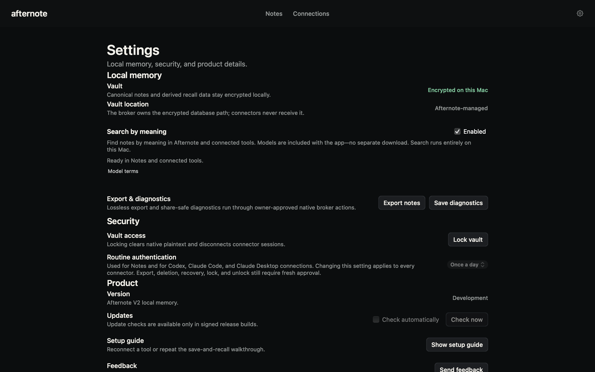
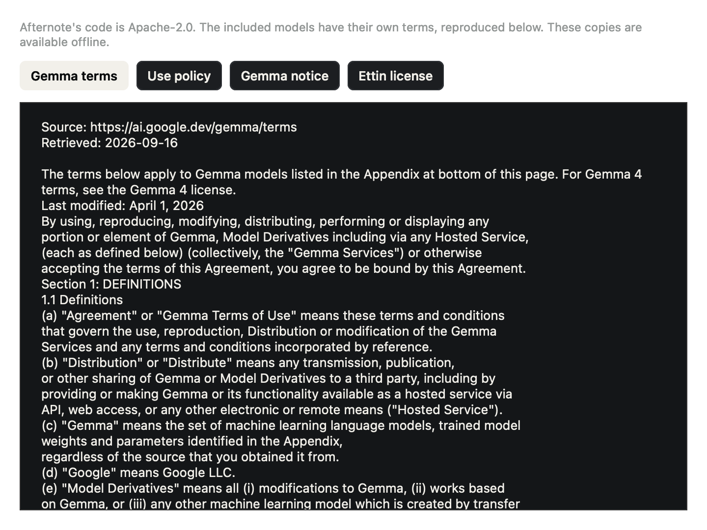

# Search by meaning in Beta 1

Implementation baseline: `6b92d220bf3da9659a57e36ab237e318794cdf97` (Alpha 26).
The September 16 decision supersedes the Alpha 26 opt-in download flow.

## Scope and acceptance

- Ship one included engine: pinned EmbeddingGemma Q4 plus Ettin ARM INT8. No model-tier UI
  or first-run download. Include licenses, use restrictions and file digests in the sealed app.
- Search by meaning defaults on for Notes and approved connected-tool Recall. A right-aligned
  Enabled checkbox in Settings persists an explicit off choice. Show preparing, ready, off,
  missing/tampered files and activation failure clearly. Model terms are accessible in Settings.
- Opening an unlocked vault prepares the local runtime and indexes notes. Saving and editing
  queue derived indexing automatically. Immediate semantic recall can await indexing within
  its existing time budget; an exact match must remain immediately available while indexing.
- Settings changes use the authenticated Library refresh endpoint. A locked vault, expired
  session or revoked connector cannot be bypassed. Late replies cannot restore protected UI.
- Disable and model replacement retire queued inference; pending queries must not disclose
  stale note content. Existing authority, encryption, export and revision behavior stays intact.
- Runtime/model failures fall back visibly to exact search. A missing or invalid bundled model
  never initiates a network download. Reinstall repairs immutable model files; restarting the
  vault retries runtime preparation. Note data must survive either recovery.
- Keep Alpha 25 and Alpha 26 artifacts intact. Build a new Beta 1 with monotonically increasing
  Apple build number. Run type checking, focused tests, full suite, package/install checks,
  signed release pipeline, and independent signed artifact verification. Record remaining
  human-presence and second-Mac acceptance honestly; do not treat developer fixtures as those.
- Prepare announcement copy about explicit saving, useful recall across apps, granular access
  and security. Do not publish an announcement without the founder's final review.

## Beta quality

Useful everyday recall is the product bar. The existing measured limitations in
[BETA_READINESS.md](BETA_READINESS.md) are accepted. No additional model shopping,
agent-generated metadata, or perfect synthetic benchmark target is required.

## Native layout

### Beta 1 acceptance feedback (baseline `88d1ab6`)

- Explain that model files are included; preparing search means local warm-up/indexing,
  not a download. Label the ready and preparing states consistently with Search by meaning.
- Read the complete included model terms inside an offline, selectable native window,
  without relying on a Markdown file association. Include the Gemma policy and notice.
- Remove static Connector identities and production Build policy rows from Settings.
  Preserve the conspicuous owner-presence-bypass warning in development builds.
- Provide one self-contained founder acceptance checklist with actions, expected results,
  exact synthetic notes, and room to record failures. Do not imply the installed Beta 1
  artifact contains later source changes or claim unperformed hands-on acceptance.

Synthetic-data preview of the Beta 1 settings layout (development preview; release builds
also expose model terms and signed update controls):

## Beta 2 indexing feedback (baseline `10523e6`)

- A search response reporting indexing must start authenticated progress polling even
  after the initial activation has finished. Poll every two seconds, with one in-flight
  request. Completion must update Notes and Settings without navigation or relaunch.
- Show real indexed/total counts and a progress bar. Model warm-up has an indeterminate
  state; ready collapses the bar and explanation to one quiet status row.
- After a minute without changed progress, say that indexing is taking longer than
  expected. A failed status check must be visibly distinct, offer Check again, and stop
  automatic retries after three consecutive failures. Exact search remains available.
- Lock/session invalidation clears counts and cancels queued polling; late replies cannot
  restore protected state. Views only render; the owner coordinator owns broker requests.
- Preserve the immutable Beta 1 package. Package these changes and the prior Settings
  fixes as 2.0.0-beta.2, Apple build 28. Do not publish a release or announcement.

The native regression reproduced the missing poll after a search returned indexing.
The bundled-model integration test now starts cold and checks a 15-note index reaches
ready using the same authenticated progress endpoint. This verifies the reproduced
mechanism; acceptance on the Mac that reported the hour-long status remains necessary.

## Beta 2 acceptance regressions (baseline `85f0a74`)

- Revoking a connector directly from the passive Connections overview must request fresh
  native owner approval. It must not depend on first opening an authenticated inspection
  session. Denial leaves access unchanged; approval stops Remember, Recall and Get on all
  targeted identities. Trusted caller roles, connection-bound single-use approval, exact
  target revision checks, and explicit reconnect requirements remain enforced.
- Reproduce the reported cross-connector canary recall misses using the shipped models,
  the actual query arguments and signed connector requests. Do not claim that an empty
  search proves no note exists or that notes are private to the connector that saved them.
  Confirm the affected Mac's runtime version before treating local fixture success as a fix.

## Beta 3 sustained-use failure (baseline `89b3c2f`)

- Normal two-second search-status polling must remain available beyond 1,024 requests.
  Owner replay defense must stay bounded without a global daily request quota or accepting
  old/repeated requests after eviction, time expiry, or vault lock/unlock.
- After sustained polling, Notes must still open and read saved notes. Direct connector
  revocation must request fresh approval, reject subsequent actual connector reads/writes,
  preserve access for unrelated connectors, and remain revoked after refresh.
- Locked-state status checks must not prevent a subsequent approved unlock and Notes reopen.
- Exercise the native owner client's actual XPC transport and encrypted broker in an isolated
  fixture, as well as a deterministic clock-advanced worker regression. Simulated presence is
  not evidence of physical Touch ID acceptance on the affected Mac.
- Make the native gateway integration suite a required local release gate. Keep the prior
  Beta 3 installer immutable. No announcement while affected-Mac acceptance remains open.

## Beta 4 idle-worker search startup (baseline `72ebddb`)

- The private native gateway long-poll must not block the worker's JavaScript event loop.
  Background model preparation and indexing must finish while the owner is idle or only
  checking status, including after lock/unlock with all embeddings already persisted.
- Retain serial worker dispatch, exact peer code requirements, bounded message validation,
  connection identity, response correlation, owner approval and lock/revocation policy.
- Exercise the real AppKit Notes controller over the native XPC gateway and encrypted
  worker, with asynchronous model preparation. Assert it reaches ready automatically,
  hides progress and stops polling after lock/unlock. No semantic query may be required
  to make runtime preparation advance after reopening.
- Require a second release run through that native path using the pinned bundled models.
  Simulated presence in test services is not real installed-app owner approval.
- Preserve the Beta 4 artifact. Any replacement installer uses Beta 5 / Apple build 31.
  Do not claim the affected work Mac is verified before it runs the replacement.
